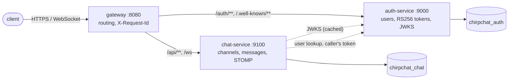

# ChirpChat

[](https://github.com/kartikey13kaushiq/chirpchat/actions/workflows/ci.yml)
 
 

Slack-style team chat built as three independently deployable services. There are public and
private channels, @mentions, unread counts and real-time delivery over WebSocket. Services trust
each other through **asymmetric JWTs**: only the auth service holds a signing key, and every
other service verifies tokens against its published JWKS.



| Service | Responsibility | Notable details |
|---|---|---|
| **auth-service** | Accounts and tokens | BCrypt; RS256 access tokens (15 min) with `iss`, `aud`, `kid`; opaque refresh tokens stored as SHA-256 hashes, rotated on use, with **reuse detection** (replaying a rotated token revokes the whole family); `/.well-known/jwks.json` publishes the public key only; constant-work login failures. |
| **chat-service** | Channels, membership, messages, real time | OAuth2 resource server validating signature, issuer, audience and expiry against the JWKS; gap-free per-channel sequence numbers under a row lock; cursor pagination; unread counts from read markers; @mentions resolved against channel members; STOMP events fanned out per user after commit. |
| **gateway** | Single entry point | Spring Cloud Gateway: path routing for HTTP and WebSocket, security headers, and an `X-Request-Id` that is generated or kept, forwarded and echoed so logs correlate across services. |

Each service owns its own database and migrates it with Flyway. The chat service stores only the
user ids and usernames it needs, taken from verified tokens. When an owner adds someone by
username, the chat service asks the auth service, **forwarding the caller's own token**, so no
service-wide credential exists that could be stolen.

### Design decisions

- **Per-user fan-out instead of a topic per channel.** Membership is checked when each event is
  produced. Removing someone from a private channel therefore cuts off delivery immediately,
  with no stale subscription left to revoke. A test proves it.
- **Private channels answer 404 to outsiders**, so their existence does not leak. Public
  channels answer 403 ("join first") when you try to post without being a member.
- **Refresh-token families.** Rotation alone does not catch a stolen token that is used
  first. Treating any replay as compromise and revoking the family does.
- **Downstream failures are explicit.** If the user directory is unreachable, the call returns
  `502 UPSTREAM_UNAVAILABLE` with a timeout, not a hung request.

## Run it

```bash
docker compose up --build        # PostgreSQL + the three services; gateway on http://localhost:8080
./scripts/smoke.sh               # end-to-end check through the gateway
```

```bash
curl -s localhost:8080/auth/register -H 'content-type: application/json' \
  -d '{"username":"ada","displayName":"Ada","password":"correct-horse-battery"}'
TOKEN=$(curl -s localhost:8080/auth/token -H 'content-type: application/json' \
  -d '{"username":"ada","password":"correct-horse-battery"}' | jq -r .access_token)
curl -s localhost:8080/api/channels -H "authorization: Bearer $TOKEN" -H 'content-type: application/json' \
  -d '{"name":"general","topic":"Everything","isPrivate":false}'
```

For real time, connect STOMP to `ws://localhost:8080/ws` with `Authorization: Bearer <token>`
in the CONNECT headers and subscribe to `/user/queue/events`. Events: `message.created`,
`mention`, `member.joined`, `member.left`, `channel.updated`. Each service serves OpenAPI at
`/swagger-ui.html`.

| Variable | Service | Purpose |
|---|---|---|
| `AUTH_SIGNING_KEY` | auth | RSA private key (PKCS#8 PEM). If unset, an ephemeral key is generated and a warning is logged. |
| `AUTH_ISSUER` | auth, chat | Token issuer; must match on both sides |
| `AUTH_JWKS_URI`, `AUTH_BASE_URL` | chat | Where to fetch keys and look up users |
| `DATABASE_URL`, `DATABASE_USERNAME`, `DATABASE_PASSWORD` | auth, chat | PostgreSQL |
| `AUTH_SERVICE_URL`, `CHAT_SERVICE_URL`, `CHAT_SERVICE_WS_URL` | gateway | Upstreams |

Generate a signing key with `openssl genpkey -algorithm RSA -pkeyopt rsa_keygen_bits:2048`.

## API

| Service | Endpoints |
|---|---|
| auth | `POST /auth/register`, `POST /auth/token`, `POST /auth/refresh`, `POST /auth/logout`, `GET /auth/me`, `GET /auth/users/{username}`, `GET /.well-known/jwks.json` |
| chat | `GET /api/channels` (mine, with unread), `GET /api/channels/discover?q=`, `POST /api/channels`, `GET/PATCH /api/channels/{id}`, `POST /api/channels/{id}/join`, `GET/POST /api/channels/{id}/members`, `DELETE /api/channels/{id}/members/{userId}`, `POST /api/channels/{id}/read`, `GET/POST /api/channels/{id}/messages` |

Errors are [RFC 9457](https://www.rfc-editor.org/rfc/rfc9457) problem details with a stable
`code`, and a `fields` map for validation errors.

## Tests

```bash
./mvnw verify      # all modules; PostgreSQL via Testcontainers (or TEST_DATABASE_URL); JaCoCo gate 80%
```

- **auth-service:** issued tokens verify against the published JWKS; refresh rotation, reuse
  detection, logout and expiry (using a controllable clock); uniform login failures; PEM key
  loading.
- **chat-service:** discovery, joins, private-channel isolation, owner-only actions and owner
  hand-over, directory lookups (found / unknown / upstream down → 502), mentions, pagination,
  unread counts. Tokens with a wrong signature, issuer or audience, or that have expired, are
  rejected. Real STOMP clients cover delivery and the immediate cut-off after removal.
- **gateway:** routing to stub upstreams, request-id generation, propagation and sanitising.
- **End to end:** CI builds the images, starts the Compose stack and runs `scripts/smoke.sh`
  through the gateway.

## Production notes

- Run more than one chat-service instance behind a STOMP broker relay (RabbitMQ or ActiveMQ),
  in place of the in-memory broker, so events reach users connected to other nodes.
- Rotate signing keys by publishing the new key in the JWKS before signing with it. Resource
  servers refetch the JWKS when they see an unknown `kid`.
- Add rate limiting at the gateway, for example Spring Cloud Gateway's `RequestRateLimiter`
  with Redis on `/auth/token`.

## License

[MIT](LICENSE)
